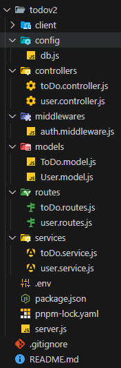

# TaskManager

**TaskManager** est une application web de gestion de tâches permettant aux utilisateurs de créer, modifier, suivre et organiser leurs tâches quotidiennes. Le projet repose sur la stack MERN (MongoDB, Express, React, Node.js).

## 🧩 Fonctionnalités

- Authentification sécurisée (inscription, connexion, déconnexion)
- Création, edition et suppression de tâches (et bientôt filtrage des tâches)
- Gestion de l’état d’une tâche (à faire ou terminée)
- API REST sécurisée avec cookies

## Travail à venir:

- Filtrage de tâches par titre
- Classement des tâches par priorité ou date

## 🛠️ Stack technique

- **Frontend** : React + Vite
- **Backend** : Node.js + Express
- **Base de données** : MongoDB + Mongoose
- **Authentification** : JWT + cookies sécurisés
- **Autres** : Tailwind CSS, dotenv, axios

## 📁 Structure du projet

## 🔐 Authentification
L'application utilise un système de double token :
- **AccessToken** (durée courte, stocké côté client)
- **RefreshToken** (httpOnly, stocké en cookie, permet de renouveler l'accessToken)

### Clonage du projet

git clone https://github.com/votre-nom/taskmanager.git
cd taskmanager

##Lancemenet du projet
npm run start

